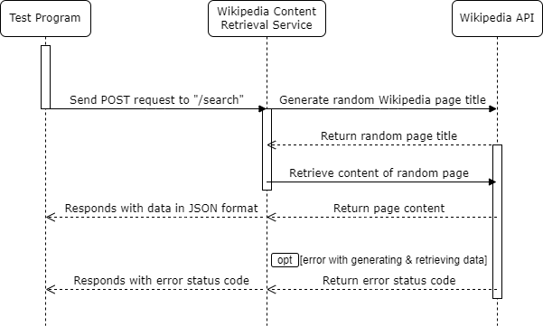

# Wikipedia Content Retrieval Microservice

This Flask-based microservice provides an API to search and retrieve content from Wikipedia. Below you will find instructions on how to request and receive data from this service, as well as a UML sequence diagram to clarify the process.

## Getting Started

### Prerequisites
Ensure you have Python and pip installed on your system. You also need Flask and the wikipedia library. Install them using pip:
```bash
pip install Flask wikipedia
```

### Running the Service
Navigate to the project directory and run the application:
```bash
python app.py
```
The service will be available at "http://127.0.0.1:5000". 


## Using REST API

### Requesting Data
To request data from the microservice, send a POST request to the **'/search'** endpoint with a URL-encoded body. Here is an example using Python's **'requests'** library:
```bash
import requests

# URL of the microservice
microservice_url = "http://127.0.0.1:5000/search"

# Sending a request to the microservice
response = requests.post(microservice_url)

# Checking if the request was successful
if response.status_code == 200:
    # Displaying that the request was successful
    print("Microservice request was successful.")
    
    # Displaying the retrieved data
    print("Here's the information we retrieved from a random Wikipedia page:\n")
    print(response.json()['result'])
else:
    print("Error:", response.status_code)
```

### Receiving Data
The microservice responds with data in JSON format. To programmatically receive data from the microservice, follow these steps:

1. Receive the response from the microservice.
2. Extract the data from the response in JSON format.

**Successful Response**
* If the microservice successfully retrieves data from a random Wikipedia page, it will respond with the content of that page.
* The TestProgram will receive and display the retrieved data.

**Error Handling**
* If there is an error while retrieving data from the microservice, the microservice will respond with an error status code.
* The TestProgram will display the error status code.

## UML Diagram
Below is the UML sequence diagram showing the interactions between the Test Program, the Wikipedia Content Retrieval Microservice, and Wikipedia API:



### Diagram Explanation
1. **Test Program Interaction**: The TestProgram sends a POST request to the Microservice.
2. **Wikipedia Content Retrieval Microservice to Wikipedia API**: Microservice sends a POST request to the Wikipedia API to generate a random Wikipedia page title.
3. **Wikipedia API Response to Wikipedia Content Retrieval Microservice**: Wikipedia API returns a random page title to the Microservice.
4. **Wikipedia Content Retrieval Microservice to Wikipedia API**: Microservice sends a request to the Wikipedia API to retrieve the content of the random page.
5. **Wikipedia API Response to Wikipedia Content Retrieval Microservice**: Wikipedia API returns the content of the random page to the Microservice.
6. **Wikipedia Content Retrieval Microservice Response to Test Program**: Microservice responds with data in JSON format to the TestProgram.


